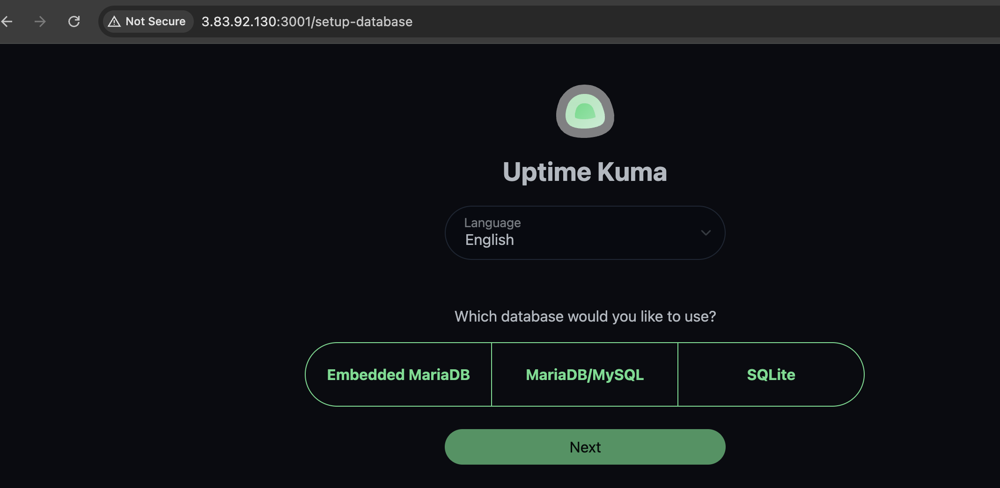
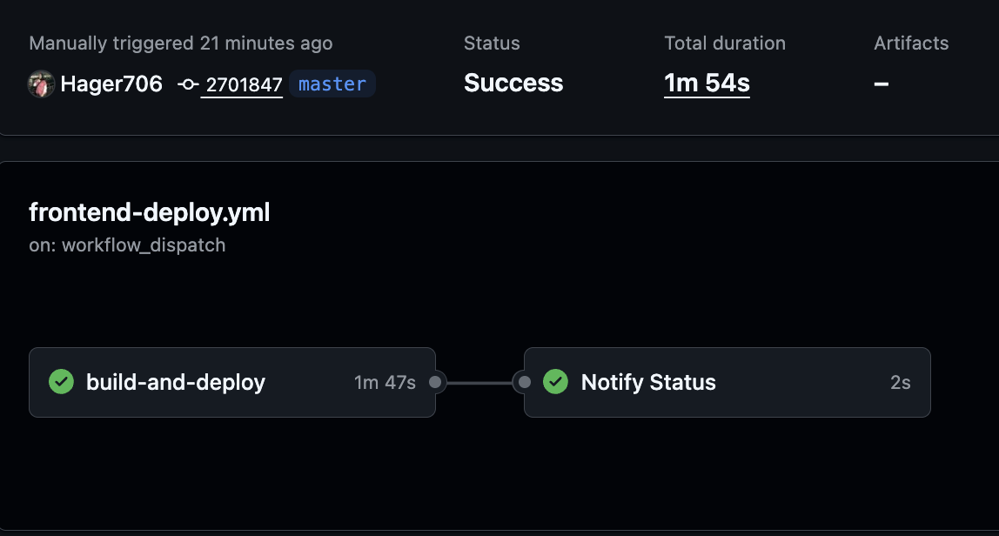

# Frontend Deployment - Uptime Kuma

This repository contains the deployment setup for the Uptime Kuma frontend application using GitHub Actions.

## Deployment Pipeline

The GitHub Actions pipeline (`.github/workflows/deploy.yml`) automates the deployment of Uptime Kuma to an Ubuntu server using Docker.

### Key Steps:

1. **Build Step**
   - Simulates the build process as required by the task.
   - Displays deployment information (repository, branch, commit).

2. **Deploy to EC2**
   - Connects to EC2 server via SSH.
   - Creates `docker-compose.yml` configuration.
   - Pulls the latest Uptime Kuma image from Docker Hub (`louislam/uptime-kuma:1`).
   - Starts/restarts containers with `docker-compose up -d`.

3. **Deployment Notification**
   - Reports deployment status (success/failure).
   - Provides access URL for the application.

### Requirements

- **EC2 Instance**: Ubuntu 22.04, t2.micro (1 vCPU, 1GB RAM, 8GB disk)
- **Docker & Docker Compose**: Pre-installed on the server
- **GitHub Secrets**:
  - `EC2_HOST`: Frontend server public IP
  - `EC2_USERNAME`: SSH username (ubuntu)
  - `EC2_SSH_KEY`: Private SSH key for authentication


### Access

After successful deployment, access the application at:
```
http://<EC2_HOST>:3001
```

### Screenshots


